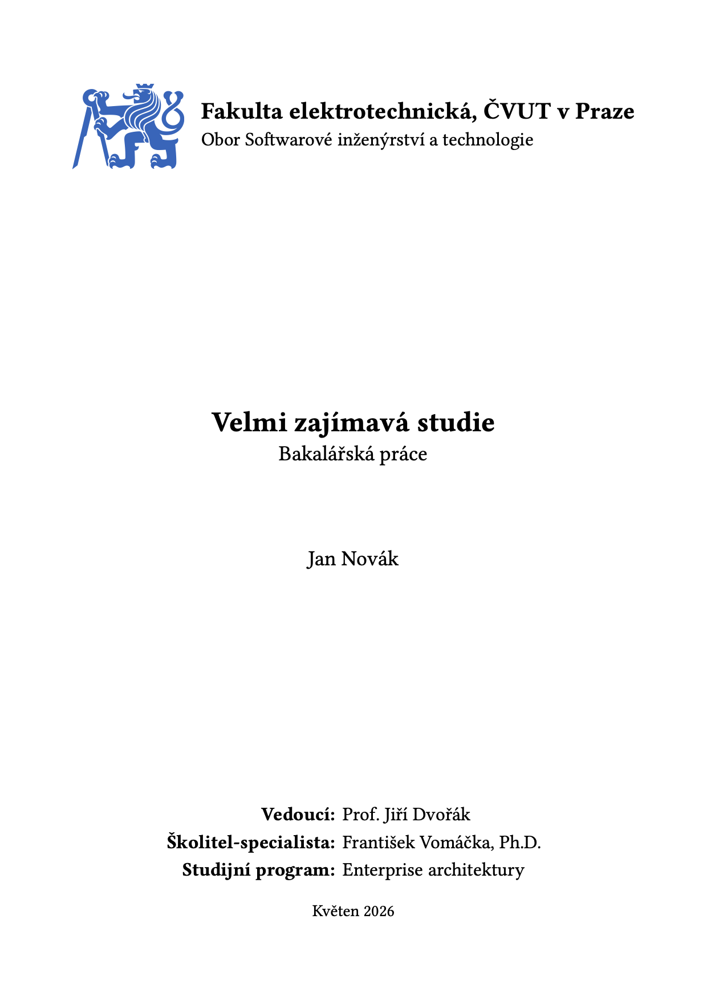

<h1 align="center">ctu-thesis</h1>

<p align="center">
  <strong>A clean Typst thesis template for CTU in Prague.</strong><br>
</p>

<p align="center">
  <!---->
  
  
  <a href="LICENSE"></a>
</p>

<p align="center">
  
</p>

`ctu-thesis` is an unofficial Typst template for qualification theses at the Czech Technical University in Prague. It currently focuses on the Faculty of Electrical Engineering (`fel-thesis`).

> [!IMPORTANT]
> This template is still WIP. Always verify the final PDF against your faculty's current thesis requirements before submitting.

## Features
- Nice cover page with logo, study branch, thesis type, author, supervisor/details grid, and submission date.
- Czech and English abstract pages with localized keywords.
- Styled table of contents via `fel-toc`.
- Sensible thesis layout: 11pt serif text, justified paragraphs, numbered headings, first-line indentation, and clean figures/code-blocks.
- Optional print binding gutter with wider inside margin.
- Template project with CTU logo and ISO690-numeric citation style.

## Quick start
> [!IMPORTANT]
> This package isn't published to the Typst Universe yet, so it can't be imported like this as of this time!

Initialize a fresh project with:
```sh
typst init @preview/ctu-thesis:0.0.1 my-thesis
cd my-thesis
typst watch main.typ
```
Typst will copy the starter project (from the `template` folder) and keep recompiling the PDF whenever you make changes.

## Usage
A minimal thesis starts with a single `show` rule:
```typ
#import "@preview/ctu-thesis:0.0.1": fel-thesis

#show: fel-thesis.with(
  title: "Velmi zajímavá studie",
  subtitle: "Bakalářská práce",
  author: "Jan Novák",
  details: (
    "Vedoucí": "Prof. Jiří Dvořák",
    "Školitel-specialista": "František Vomáčka, Ph.D.",
    "Studijní program": "Enterprise architektury",
  ),
  date: "Květen 2026",
  abstract-cz: [
    This is the Czech abstract of the thesis.
  ],
  abstract-en: [
    This is the English abstract of the thesis.
  ],
  keywords-cz: ("pes", "a", "kočička"),
  keywords-en: ("dog", "and", "cat"),
  branch: "Obor Softwarové inženýrství a technologie",
  logo: image("assets/cvut-logo.svg"),
)

= První kapitola
// TODO: start writing here
```

The bundled starter also includes a bibliography call:
```typ
#bibliography(
  "references.yaml",
  style: "assets/iso690-numeric-brackets-cs.csl",
)
```

## Configuration
`fel-thesis` accepts the following named arguments:

| Option | Type | Default | Description |
| --- | --- | --- | --- |
| `title` | `str` | `"REPORT TITLE"` | Thesis title shown on the cover page and in PDF metadata. |
| `subtitle` | `str` | `"REPORT SUBTITLE"` | Thesis type or subtitle, e.g. `"Bachelor's Thesis"`. |
| `author` | `str` | `"AUTHOR NAME"` | Author name shown on the cover page and in PDF metadata. |
| `details` | `dictionary` | `()` | Label/value pairs displayed on the cover page, such as supervisor or programme. |
| `date` | `str` | `"DATE OF SUBMISSION"` | Submission month/year or full date. |
| `abstract-cz` | `content` / `str` | `"ABSTRACT TEXT CZ"` | Czech abstract. |
| `abstract-en` | `content` / `str` | `"ABSTRACT TEXT EN"` | English abstract. |
| `keywords-cz` | `array` | `("KEYWORDS", "CZ")` | Czech keywords, joined with commas. |
| `keywords-en` | `array` | `("KEYWORDS", "EN")` | English keywords, joined with commas. |
| `university` | `str` | `"Fakulta elektrotechnická, ČVUT v Praze"` | Faculty/university label on the cover page. |
| `branch` | `str` | `"YOUR STUDY BRANCH"` | Study branch shown below the faculty name. |
| `toc-title` | `str` | `"Obsah"` | Title of the table of contents page. |
| `logo` | `content` / `none` | `none` | Logo content, typically `image("assets/cvut-logo.svg")`. |
| `gutter` | `bool` | `false` | Enables binding-friendly inside/outside margins. |
| `body` | `content` | required | The actual thesis content after front matter. |

## Exported helpers
| Helper | Use it for |
| --- | --- |
| `fel-thesis` | Full FEL thesis structure: cover, abstracts, table of contents, page numbering, and body. |
| `fel-cover` | Standalone FEL-style cover page. |
| `fel-toc` | Standalone styled table of contents. |

## Project structure
```text
ctu-thesis/
├─ lib.typ                  # public exports
├─ typst.toml               # typst package manifest
├─ src/
│  ├─ core.typ              # shared CTU layout primitives
│  └─ faculties/
│     └─ fel.typ            # FEL cover, TOC, and thesis wrapper
└─ template/
   ├─ main.typ              # starter thesis (showcase)
   ├─ references.yaml       # hayagriva bibliography example
   └─ assets/
      ├─ cvut-logo.svg
      └─ iso690-numeric-brackets-cs.csl
```

## Asset Credits
- **Logo:** [ČVUT Logo & Graphic Manual](https://www.cvut.cz/logo-a-graficky-manual)
- **Citation Style:** [ISO 690 (Numeric, Brackets, Czech) CSL Style](https://github.com/citation-style-language/styles/blob/master/iso690-numeric-brackets-cs.csl)

## License
MIT - see [`LICENSE`](LICENSE).
